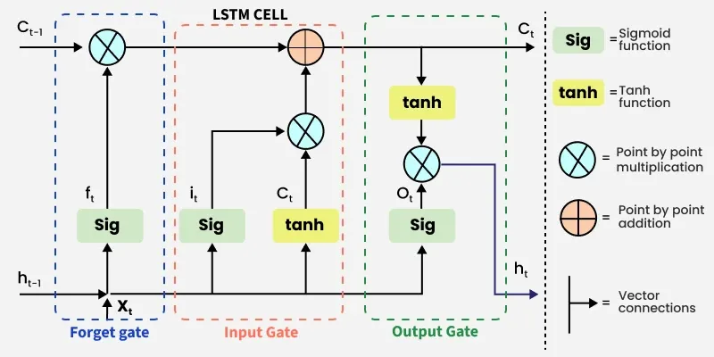

# 🧠 LSTM From Scratch

*No `PyTorch`. No `TensorFlow`. Just pure math, matrices, and `numpy`.*

---

## 🚀 The Vibe

Why type `model = LSTM()` in one second when you can spend hours building the exact same thing from scratch? 

This folder is all about ripping away the high-level abstractions. We are getting our hands dirty with raw gradients, Backpropagation Through Time (BPTT), and matrix multiplications. If it involves a neural network memory cell, we are building its gears manually using nothing but **`numpy`** and sheer willpower.

---

## 🏗️ The Architecture 

To truly understand how an LSTM decides what to remember and what to throw away, you have to look at the gates. Here is the blueprint of what we are building in the code:

 

### ⚙️ How the Magic (Math) Works:
Inside `LSTM_from_scratch.py`, you'll find the manual implementation of these exact components:

* 🗑️ **The Forget Gate:** Looks at the previous hidden state and the current input, then coldly decides what information is useless and should be thrown away.
* 📥 **The Input Gate:** Decides what *new* information is actually worth adding to the cell state. 
* 🔄 **The Cell State:** The long-term memory conveyor belt. It carries the core information forward, updated dynamically by the Forget and Input gates.
* 📤 **The Output Gate:** Decides what the next hidden state should be based on the newly updated cell state.

---

## 📂 Files in this Lab

* `LSTM_from_scratch.py`: The heart of the beast. All the matrix math, sigmoid/tanh activations, and gates live here.
* `Test.py`: The testing ground. Run this to see the NumPy-powered LSTM actually learn something!
